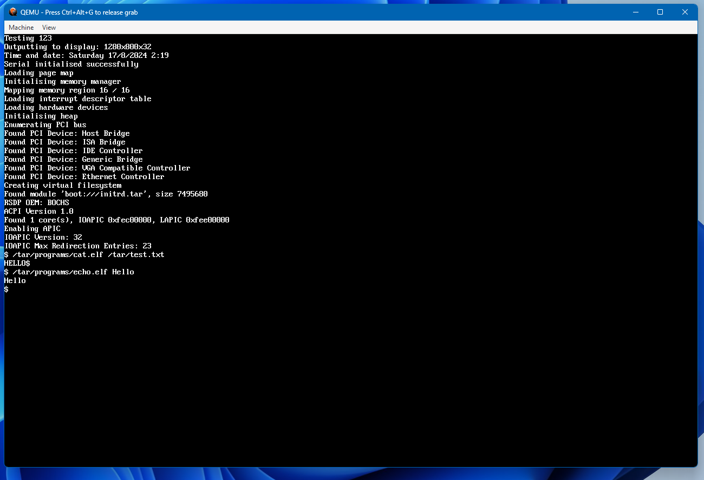

# About Me
Software / Electrical Engineer\
I am studying Electrical and Computer Systems Engineering at Monash University. My main interests are low-level systems programming, operating systems and computer architecture and performance optimisation. I am interested in how operating systems and applications interact with hardware, and enjoy the challenges of systems programming and optimisation.

# Projects
## 3D Game with Custom Engine Written in C++ (in progress)
C++, DirectX, HLSL\
Strategy / Tower Defense game with multiplayer

### Features
* Platform abstraction layer for the Windows API and DirectX 11
* Custom memory allocation using memory arenas to replace malloc() and free()
* Procedurally generated map
* Performance profiling using CPU timestamp counters
* Integrated developer console

[Github Repository](https://github.com/JoelAKruger/Tower-Defense)

## AI Aim Assist
C++, DirectX, OpenCV, Python, Arduino \
Uses a custom trained Yolov8 model along with an arduino microcontroller to help the player aim at an enemy. This required a lot of optimisation to run in real time with low latency, such as doing image processing with DirectX and writing the program in C++ instead of Python.

[Github Repository](https://github.com/JoelAKruger/GetGood)

## x86 Operating System
C++, Assembly\
Multithreading operating system for x86, written in C++ and Assembly. Allows the running of user programs and implements various system calls. Supports PS2 keyboard and mouse, and outputs to a bitmap display device. It is able to boot on real hardware.

Running cat and echo from the command line interface \

Basic graphical user interface \

## 2D Game Written in C++
C++, SDL2, Emscripten \
Fighting game written in C++ using SDL2, which can compile to WebAssembly and run in a web browser.

[Github Repository](https://github.com/JoelAKruger/Margarita)
# Contact
Email: joelkruger@optusnet.com.au \
LinkedIn: https://www.linkedin.com/in/joel-a-kruger
